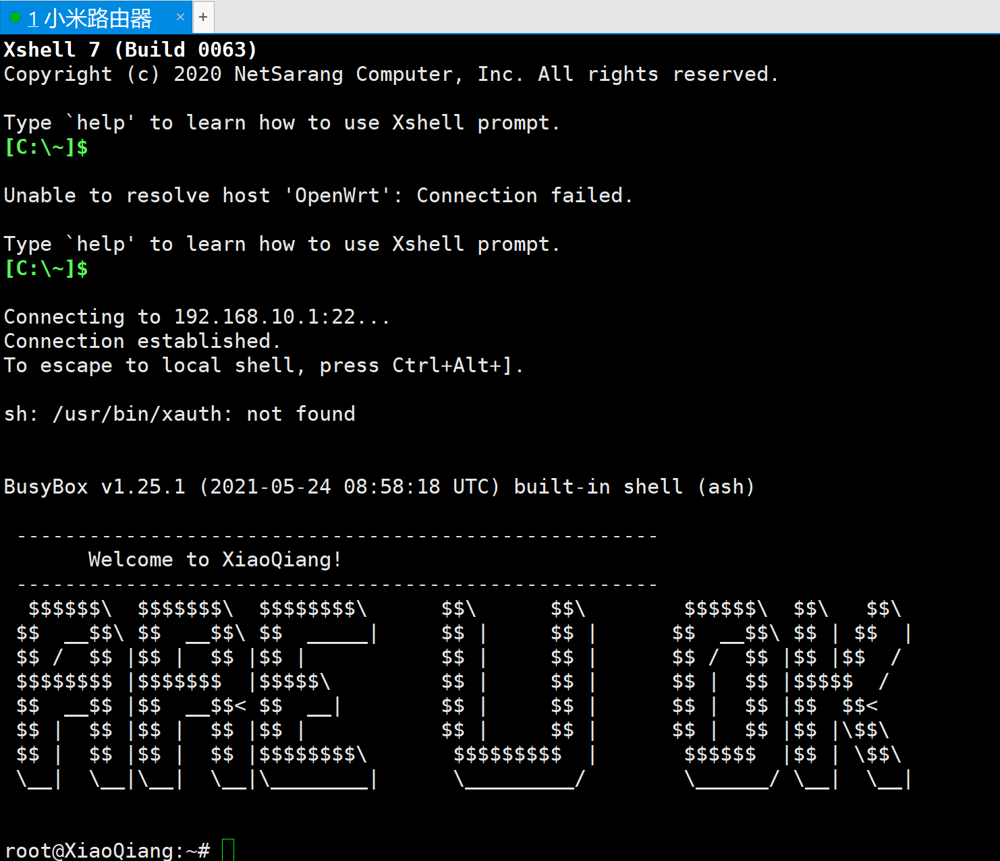
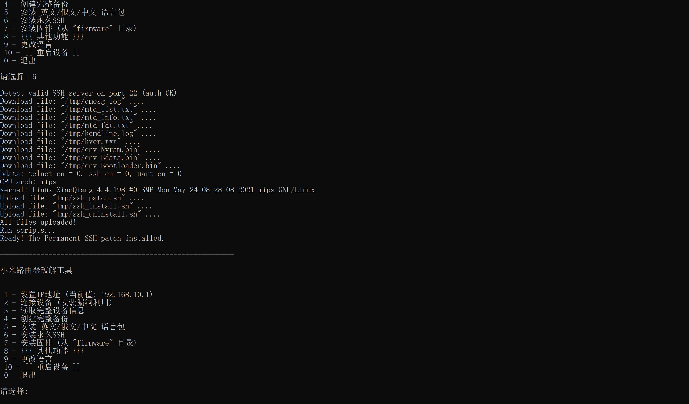

# 小米路由器破解工具 (XMiR-Patcher)

[](https://github.com/longzheng268/Xiaomi-Router-patcher/archive/refs/heads/main.zip)

[](https://mirom.ezbox.idv.tw/en/miwifi)
一个功能强大的小米路由器固件破解工具，支持多种小米路由器型号的漏洞利用、SSH启用、语言包安装、固件刷写等功能。

## 📋 目录

- [支持的设备](#支持的设备)
- [功能特性](#功能特性)
- [安装教程](#安装教程)
- [使用指南](#使用指南)
- [详细功能说明](#详细功能说明)
- [故障排除](#故障排除)
- [安全提示](#安全提示)
- [开发说明](#开发说明)
- [贡献指南](#贡献指南)

## 🔧 支持的设备

### 完全支持的型号
本工具支持以下小米路由器型号（按型号ID排序）：

#### 第一代系列
- **R1CM** (miwifi-mini) - 小米路由器 Mini
- **R1CL** (miwifi-nano) - 小米路由器 Nano
- **R2D** - 小米路由器 2
- **R2CM** - 小米路由器 2

#### 第三代系列  
- **R3** - 小米路由器 3
- **R3D** (r3d) - 小米路由器 3D
- **R3L** (miwifi-3c) - 小米路由器 3C
- **R3P** (mi-router-3-pro) - 小米路由器 3 Pro
- **R3A** - 小米路由器 3A
- **R3G** (mi-router-3g) - 小米路由器 3G
- **R3GV2** (mi-router-3g-v2) - 小米路由器 3G V2

#### 第四代系列
- **R4** (mi-router-4) - 小米路由器 4
- **R4C** (mi-router-4q) - 小米路由器 4Q
- **R4A** (mi-router-4a-gigabit) - 小米路由器 4A 千兆版
- **R4CM** (mi-router-4c) - 小米路由器 4C
- **R4AC** (mi-router-4a-100m) - 小米路由器 4A 百兆版

#### AC系列
- **R2100** (mi-router-ac2100) - 小米路由器 AC2100
- **RM2100** (redmi-router-ac2100) - 红米路由器 AC2100
- **R2200** - 小米路由器 AC2200
- **R2350** (aiot-ac2350) - 小米 AIoT 路由器 AC2350
- **R2600** - 小米路由器 AC2600

#### AX系列 (Wi-Fi 6)
- **R3600** (ax3600) - 小米路由器 AX3600
- **R1350** - 小米路由器 AX1350
- **RA67** - 红米路由器 AX1800C
- **RA69** (ax6) - 小米路由器 AX6
- **RA70** (ax9000) - 小米路由器 AX9000
- **RA71** - 红米路由器 AX1800
- **RA72** - 小米路由器 AX6000
- **RA75** (mi-ra75) - 小米路由器 RA75
- **RA80/RA82** - 小米路由器 AX3000

#### 企业级系列
- **CR6006** (mi-router-cr6606) - 小米企业路由器 CR6606
- **CR6008** (mi-router-cr6608) - 小米企业路由器 CR6608  
- **CR6009** (mi-router-cr6609) - 小米企业路由器 CR6609

#### TR系列
- **TR608** - 小米路由器 TR608
- **TR609** - 小米路由器 TR609

#### 其他型号
- **P01** - 小米随身路由器
- **D01** - 小米路由器 HD
- **IR1200G** - 小米路由器 1200G
- **RM1800** - 红米路由器 1800
- **R2100D** - 小米路由器 AC2100D
- **RA50** - 小米路由器 RA50

> **注意**: 不同型号支持的功能可能有差异，建议在操作前仔细阅读相关说明。

## ✨ 功能特性

### 核心功能
- 🔓 **漏洞利用**: 自动检测并利用小米路由器的已知漏洞
- 🔑 **SSH启用**: 永久启用SSH访问，方便高级用户管理
- 🌐 **多语言支持**: 安装英文/俄文/中文语言包，支持中文菜单界面
- 💾 **完整备份**: 创建路由器固件的完整备份
- 🔄 **固件刷写**: 支持自定义固件的安装
- ⚡ **Bootloader替换**: 支持安装Breed等第三方Bootloader

### 高级功能
- 📊 **设备信息读取**: 获取详细的硬件和系统信息
- 🔐 **密码修改**: 修改路由器root密码
- 📋 **日志读取**: 读取系统日志和内核信息
- ⚙️ **分区备份**: 创建指定分区的备份
- 🚀 **引导设置**: 设置内核引导地址
- 🔧 **功能解锁**: 解锁隐藏的路由器功能

## 🚀 安装教程

### Windows 用户

1. **下载工具包**
   ```
   下载并解压项目文件到任意目录
   ```

2. **运行工具**
   ```
   双击运行 run.bat 文件
   ```

3. **自动环境配置**
   - 工具会自动使用内置的 Python 环境
   - 无需手动安装 Python 或依赖包

### Linux / macOS 用户

1. **系统要求**
   ```bash
   # 确保已安装 Python 3.8+ 和 OpenSSL
   python3 --version  # 应显示 3.8 或更高版本
   openssl version    # 确认 OpenSSL 已安装
   ```

2. **安装依赖**
   ```bash
   # Ubuntu/Debian
   sudo apt update
   sudo apt install python3 python3-pip python3-venv openssl
   
   # CentOS/RHEL
   sudo yum install python3 python3-pip openssl
   
   # macOS (使用 Homebrew)
   brew install python3 openssl
   ```

3. **下载并运行**
   ```bash
   # 下载项目
   git clone https://github.com/longzheng268/Xiaomi-Router-patcher.git
   cd Xiaomi-Router-patcher
   
   # 运行工具
   chmod +x run.sh
   ./run.sh
   ```

### Docker 用户

```bash
# 构建 Docker 镜像
docker build -t xmir-patcher .

# 运行容器
docker run -it --network host xmir-patcher
```

## 📖 使用指南

### 第一步：连接准备

1. **网络连接**
   - 确保电脑和小米路由器在同一网络中
   - 记录路由器的IP地址（通常是 192.168.31.1）
   - 确保能正常访问路由器管理界面

2. **启动工具**
   - Windows: 双击 `run.bat`
   - Linux/macOS: 执行 `./run.sh`

### 第二步：基本配置

运行工具后会看到主菜单：

```
==========================================================

Xiaomi MiR Patcher  

 1 - Set IP-address (current value: 192.168.31.1)
 2 - Connect to device (install exploit)
 3 - Read full device info
 4 - Create full backup
 5 - Install EN/RU languages
 6 - Install permanent SSH
 7 - Install firmware (from directory "firmware")
 8 - {{{ Other functions }}}
 9 - [[ Reboot device ]]
 0 - Exit

Select:
```

### 第三步：执行操作

#### 必要的前置步骤

1. **设置IP地址 (选项1)**
   ```
   选择 1 → 输入路由器IP地址 → 按回车确认
   ```

2. **连接设备并安装漏洞利用 (选项2)**
   ```
   选择 2 → 工具会自动检测设备型号并安装相应的漏洞利用程序
   ```
   
   > ⚠️ **重要**: 这是所有后续操作的前提，必须先成功执行此步骤！

#### 常用操作流程

1. **完整备份 (推荐首先执行)**
   ```
   选择 4 → 工具会创建完整的固件备份，保存在 backup 目录中
   ```

2. **启用SSH访问**
   ```
   选择 6 → 工具会永久启用SSH访问，默认用户名/密码: root/root
   ```

3. **安装语言包**
   ```
   选择 5 → 安装英文/俄文/中文语言包，让路由器界面支持更多语言
   ```

#### 语言界面设置

首次启动工具时，会显示语言选择菜单：
```
Language / 语言 / Язык

 1 - English
 2 - 中文 (Chinese)  
 3 - Русский (Russian)

Select language [1-English, 2-中文, 3-Русский]: 
```

选择对应数字即可切换到相应语言的菜单界面。语言设置会保存在 `config.json` 文件中。

**中文界面预览**:
```
==========================================================

小米路由器破解工具  

 1 - 设置IP地址 (当前值: 192.168.31.1)
 2 - 连接设备 (安装漏洞利用)
 3 - 读取完整设备信息
 4 - 创建完整备份
 5 - 安装 英文/俄文/中文 语言包
 6 - 安装永久SSH
 7 - 安装固件 (从 "firmware" 目录)
 8 - {{{ 其他功能 }}}
 9 - [[ 重启设备 ]]
 0 - 退出

请选择: 
```

## 🔍 详细功能说明

### 主菜单功能

#### 1. 设置IP地址
- **用途**: 设置目标路由器的IP地址
- **默认值**: 192.168.31.1
- **使用场景**: 当路由器IP不是默认值时需要修改

#### 2. 连接设备（安装漏洞利用）
- **用途**: 检测设备型号并安装对应的漏洞利用程序
- **支持的漏洞**:
  - `c_upload/netspeed` - 适用于较老型号
  - `get_icon` - 适用于较新型号
- **执行过程**:
  1. 自动检测路由器型号
  2. 选择合适的漏洞利用方法
  3. 上传并执行漏洞利用代码
  4. 启用SSH和Telnet访问

#### 3. 读取完整设备信息
- **获取信息包括**:
  - 硬件型号和版本
  - 固件版本信息
  - 分区表结构
  - 内存和存储信息
  - 网络配置
- **输出位置**: `outdir/` 目录

#### 4. 创建完整备份
- **备份内容**:
  - 所有分区的原始数据
  - Bootloader
  - 内核镜像
  - 根文件系统
  - 配置数据
- **备份格式**: 二进制镜像文件
- **存储位置**: `backup/` 目录

#### #### 5. 安装多语言包

**语言包功能详解**

**支持的语言**:
- **英文 (English)**: 完整的英文界面和语言包
- **中文 (Chinese)**: 完整的中文界面和语言包  
- **俄文 (Russian)**: 完整的俄文界面和语言包

**功能特点**:
- 🌐 **智能语言选择**: 首次运行自动显示语言选择菜单
- 💾 **持久化配置**: 语言选择保存在 `config.json` 中，下次启动自动应用
- 🔄 **实时切换**: 可通过重新运行程序切换语言
- 📱 **完整本地化**: 包括菜单、提示信息、错误消息等全面本地化
- 🎯 **路由器语言包**: 支持为路由器安装对应的语言包文件

**安装方式**: 
1. 上传语言文件到路由器
2. 修改系统配置
3. 重启相关服务
4. **卸载**: 通过扩展菜单选项5可以卸载

**技术实现**:
- 使用 UTF-8 编码支持多语言字符显示
- Windows 批处理文件使用 `chcp 65001` 支持中文显示
- 模块化翻译系统，易于扩展新语言
- 基于 `.po` 格式的标准化语言包管理

#### 6. 安装永久SSH
- **功能**: 启用持久化的SSH访问
- **默认凭据**: 
  - 用户名: `root`
  - 密码: `root`
- **端口**: 22
- **特点**: 重启后仍然有效

#### 7. 安装固件
- **支持格式**: 
  - 标准的小米固件格式
  - OpenWrt固件（需兼容）
- **固件位置**: 将固件放在 `firmware/` 目录
- **安装过程**: 自动化刷写流程

#### 8. 其他功能（扩展菜单）
进入扩展功能菜单，包含更多高级选项。

#### 9. 重启设备
安全重启路由器设备。

### 扩展菜单功能

#### 1. 设置IP地址
与主菜单功能1相同。

#### 2. 修改root密码
- **用途**: 修改路由器的root用户密码
- **安全性**: 提高系统安全性

#### 3. 读取dmesg和syslog
- **获取内容**:
  - 内核日志 (dmesg)
  - 系统日志 (syslog)
- **用途**: 故障诊断和系统分析

#### 4. 创建指定分区备份
- **灵活性**: 可选择备份特定分区
- **常用分区**:
  - `bootloader` - 引导加载器
  - `kernel` - 内核
  - `rootfs` - 根文件系统
  - `overlay` - 配置数据

#### 5. 卸载英文/俄文语言包
还原到原始的中文界面。

#### 6. 设置内核引导地址
- **用途**: 修改内核的加载地址
- **应用场景**: 安装自定义固件时使用

#### 7. 安装Breed引导加载器
- **Breed特点**:
  - 功能强大的第三方Bootloader
  - 支持Web界面固件刷写
  - 不怕刷坏（变砖保护）
- **支持型号**: 
  - R3: `pb-boot-xiaomi3-20190317-61b6d33.img`
  - R3G, R3P, RM2100, RA71: `breed_r3g_eng.bin`
  - CR6606, CR6608, CR6609, TR608, TR609: `pb-boot-cr660x.img`
- **安装命令**: `python3 install_bl.py breed`

#### 7a. 安装原厂U-Boot引导加载器
- **U-Boot特点**:
  - 设备原厂Bootloader
  - 设备特定的引导程序
  - 用于恢复原厂引导环境
- **支持型号**: 
  - R3G: `uboot_r3g.bin`
  - R3P: `uboot_r3p.bin`
  - RM2100: `uboot_rm2100.bin`
- **安装命令**: `python3 install_bl.py uboot`

#### 8. 测试功能
开发和调试用途的测试功能。

#### 9. 重启设备
与主菜单功能9相同。

## 🛠️ 故障排除

### 常见问题

#### 1. 连接失败
**问题**: 无法连接到路由器
**解决方案**:
```bash
# 检查网络连接
ping 192.168.31.1

# 检查路由器管理界面
curl -I http://192.168.31.1

# 确认IP地址正确
# 某些路由器可能使用 192.168.1.1
```

#### 2. 漏洞利用失败
**问题**: "Exploit not working" 错误
**可能原因**:
- 固件版本太新，已修复漏洞
- 路由器型号不支持
- 网络连接不稳定

**解决方案**:
```bash
# 检查设备型号支持情况
# 尝试降级固件（如果可能）
# 检查网络连接稳定性
```

#### 3. SSH连接问题
**问题**: SSH连接被拒绝
**解决方案**:
```bash
# 检查SSH服务状态
ssh root@192.168.31.1

# 如果连接被拒绝，重新执行选项6
# 检查防火墙设置
```

#### 4. 固件刷写失败
**问题**: 固件安装过程中出错
**解决方案**:
- 确保固件与设备型号匹配
- 检查固件文件完整性
- 确保有足够的存储空间
- 检查电源稳定性

#### 5. Python依赖问题
**问题**: ModuleNotFoundError
**解决方案**:
```bash
# 重新安装依赖
pip install -r requirements.txt

# 或者使用虚拟环境
python3 -m venv venv
source venv/bin/activate  # Linux/macOS
# venv\Scripts\activate   # Windows
pip install -r requirements.txt
```

### 恢复模式

如果路由器变砖，可以尝试以下恢复方法：

#### 1. 使用Breed恢复（如已安装）
1. 路由器断电
2. 按住reset键不放
3. 插入电源，等待10秒
4. 浏览器访问 `192.168.1.1`
5. 通过Web界面刷写固件

#### 2. 使用备份恢复
1. 通过SSH连接到路由器
2. 使用dd命令恢复分区：
```bash
# 恢复完整固件（谨慎操作！）
dd if=/tmp/backup.bin of=/dev/mtdblock0

# 恢复特定分区
dd if=/tmp/kernel_backup.bin of=/dev/mtdblock2
```

#### 3. TFTP恢复模式
某些型号支持TFTP恢复：
1. 设置电脑IP为 192.168.1.2
2. 运行TFTP服务器
3. 按住reset键启动路由器
4. 传输固件文件

## ⚠️ 安全提示

### 风险声明
- **⚠️ 刷机有风险，操作需谨慎！**
- **⚠️ 任何固件修改都可能导致设备变砖！**
- **⚠️ 修改固件可能失去官方保修！**
- **⚠️ 请在操作前做好完整备份！**

### 安全建议

#### 操作前准备
1. **完整备份**: 务必先执行选项4创建完整备份
2. **稳定电源**: 确保操作过程中电源稳定
3. **网络稳定**: 确保网络连接稳定
4. **充足时间**: 不要在时间紧迫时进行操作

#### 密码安全
1. **修改默认密码**: SSH启用后立即修改默认密码
```bash
passwd root
```

2. **禁用不必要的服务**:
```bash
# 如不需要Telnet，建议禁用
/etc/init.d/telnet disable
```

3. **配置防火墙**:
```bash
# 限制SSH访问的IP范围
iptables -A INPUT -p tcp --dport 22 -s 192.168.31.0/24 -j ACCEPT
iptables -A INPUT -p tcp --dport 22 -j DROP
```

#### 固件安全
1. **验证固件来源**: 只使用可信来源的固件
2. **校验文件完整性**: 使用MD5或SHA256校验
3. **渐进式升级**: 避免跨越太多版本升级

## 🔧 开发说明

### 项目结构
```
Xiaomi-Router-patcher/
├── menu.py              # 主菜单界面
├── gateway.py           # 网关通信模块
├── connect*.py          # 各种漏洞利用脚本
├── xqmodel.py           # 设备型号定义
├── read_info.py         # 设备信息读取
├── create_backup.py     # 备份功能
├── install_*.py         # 各种安装功能
├── unlock_features.py   # 功能解锁
├── xmir_base/           # 核心库
│   ├── ubireader/       # UBI文件系统读取
│   ├── fdt/             # 设备树处理
│   └── telnetlib/       # Telnet库
├── data/                # 数据文件
│   ├── payload/         # 漏洞利用载荷
│   ├── payload_ssh/     # SSH相关脚本
│   └── *.po             # 语言包文件
├── bootloader/          # 引导加载器文件
├── firmware/            # 固件存放目录
└── python/              # Windows内置Python
```

### 核心模块说明

#### Gateway类 (gateway.py)
负责与路由器的通信，包括：
- HTTP/HTTPS请求
- SSH连接
- Telnet连接
- FTP传输
- 设备检测

#### 漏洞利用模块 (connect*.py)
- `connect1.py`: c_upload/netspeed漏洞
- `connect7.py`: get_icon漏洞
- 支持多种小米路由器型号

#### 设备模型 (xqmodel.py)
定义了所有支持的设备型号和属性。

### 添加新设备支持

1. **在xqmodel.py中添加设备定义**:
```python
mi(42, "NEW_MODEL", "", "device-alt-name")
```

2. **在connect.py中添加检测逻辑**:
```python
if gw.model_id == get_modelid_by_name('NEW_MODEL'):
    # 使用适当的漏洞利用方法
```

3. **测试新设备**:
```python
# 创建测试脚本验证功能
```

### 自定义漏洞利用

参考现有的connect脚本，主要步骤：

1. **检测设备**:
```python
gw.detect_device()
```

2. **安装载荷**:
```python
install_exploit(api='API/endpoint')
```

3. **执行功能**:
```python
run_exploit('function_name', timeout=10)
```

## 🤝 贡献指南

### 如何贡献

1. **Fork 项目**
2. **创建功能分支**:
```bash
git checkout -b feature/new-feature
```

3. **提交更改**:
```bash
git commit -am 'Add new feature'
```

4. **推送分支**:
```bash
git push origin feature/new-feature
```

5. **创建 Pull Request**

### 贡献方向

- 支持新的路由器型号
- 修复现有漏洞利用
- 改进用户界面
- 增加新功能
- 完善文档
- 修复bug

### 代码规范

- 使用Python 3.8+语法
- 遵循PEP 8代码风格
- 添加适当的注释
- 编写测试用例

### 报告问题

请在GitHub Issues中报告bug或提出功能请求：
- 详细描述问题
- 提供复现步骤
- 包含系统环境信息
- 附上相关日志

## 📄 许可证

本项目采用 GPL-3.0 许可证。详见 [LICENSE](LICENSE) 文件。

## 💝 捐赠支持

如果这个项目对您有帮助，欢迎支持开发：

[](https://github.com/remittor/donate)

## 📞 联系方式

- **GitHub Issues**: [提交问题](https://github.com/longzheng268/Xiaomi-Router-patcher/issues)
- **讨论区**: [GitHub Discussions](https://github.com/longzheng268/Xiaomi-Router-patcher/discussions)

## 🙏 致谢

- 感谢原始项目的所有贡献者
- 感谢小米路由器破解社区
- 感谢OpenWrt项目
- 感谢所有测试用户的反馈

---

**⚠️ 免责声明**: 本工具仅供学习和研究使用。使用本工具进行的任何操作，风险由用户自行承担。开发者不对因使用本工具而造成的任何损失负责。

## 🖼️ 界面展示 / Interface Preview


*工具成功执行后的界面展示 / Interface after successful execution*

*ssh成功执行后的界面展示 / Interface after ssh connetct successful execution*

*ssh成功执行后的界面展示 / Interface after ssh permanent execution*

---

## English Summary

**XMiR-Patcher** is a comprehensive firmware patcher for Xiaomi routers that supports:

- **50+ Xiaomi router models** from R1CM to latest AX series
- **Exploit installation** for gaining root access
- **Permanent SSH access** with customizable credentials  
- **Full firmware backup** and selective partition backup
- **Custom firmware installation** including OpenWrt support
- **Bootloader replacement** (Breed support for R3/R3G/R3P/RM2100/RA71/CR660x/TR60x series, U-Boot support for R3G/R3P/RM2100)
- **Multi-language support** (EN/RU/ZH language packs with Chinese menu interface)
- **Advanced features** like password change, log reading, feature unlocking

### Quick Start
**Windows**: Run `run.bat` | **Linux/macOS**: Run `./run.sh`

### Basic Usage Flow
1. Set router IP address (default: 192.168.31.1)
2. Connect and install exploit (essential first step)
3. Create full backup (highly recommended)
4. Enable permanent SSH access
5. Install custom firmware or additional features

**⚠️ Warning**: Firmware modification carries risks. Always backup before proceeding!
